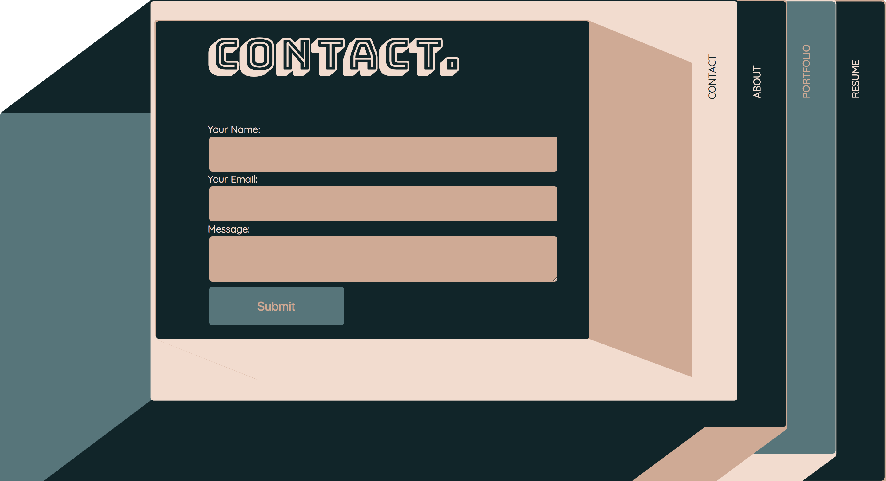
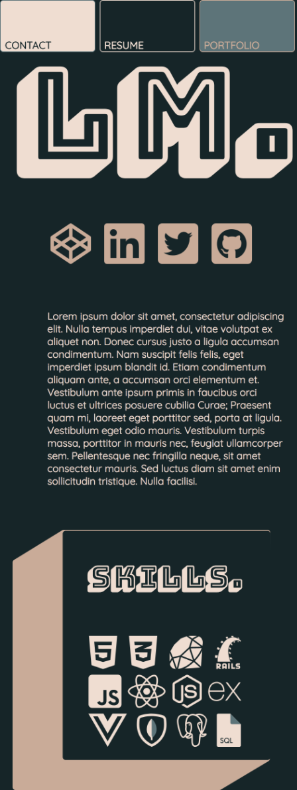

# My Portfolio Website Link
https://admiring-ramanujan-1a9961.netlify.com/index.html


# Link to GitHub repository
https://github.com/lilianamolloy/portfolio

# About the Website

## Purpose

The purpose is to design and create a portfolio site where I can showcase my work as a developer and itself is a showcase of my HTML and CSS capabilities. 

It also served a purpose as a learning experience on how to create a website from scratch. I have learnt a lot through this process including HTML, CSS, adapting plans based on time constraints and sharpening my searching skills. 

## Target audience

The target audience is potential clients and employers.

## Sitemap
---


## Planning
| Day | Tasks |
| ----------- | ----------- |
| Monday | Create a mood board, look through other websites for ideas and inspiration.|
| Tuesday | Design development. Create basic wireframe. |
| Wednesday | Finalise design. Look for examples of features I want to display on the website and see how I can incorporate them.|
| Thursday | Work on each page and complete basic layout in HTML and CSS.|
| Friday | Work on media queries to make site mobile friendly. |
| Friday | Finalise the site and complete supporting documentation. |

## Design Process

- I started by creating a mood board on Pinterest and from that found a colour pallet that I liked and wanted to work with. I also wanted to work with clean and simple designs:

    

---

- From there I sketched out a basic layout that I wanted to work with using different colour combinations from the images I found:

    
    
    

---

- The final colour combination I selected was a dark green with a salmon pink. I liked it the most because the colours really popped:
  
    

---

- From there I tested out fonts using the colours I'd chosen. My favourite combination was Bungee Shade with Quicksand. The 3d shape stood out to me and I found the combination to be well balanced:

    

---

- Based on the font I changed my design to match it and refined it until I was happy to proceed with the final design:

    
    
    
    
    
    

---

## Functionality / features

- CSS Grid
  - I used CSS grid as well as flexbox on a non-conventional website design. It required a lot of testing and planning to execute. Sometimes ending up with 4 grids embedded.

---


- Media queries
    - Due to this design, my website was not responsive. In order to fix this, I used media queries to make it mobile and tablet friendly.
``` css
@media (max-width: 1381px) {
    .content:nth-child(1) img {
        width: 850px;
    }

    .content:nth-child(1) h1 {
        font-size: 50px;
        margin-top: 70px;
    }
}
```

- hover
    - To make my site more interactive I added a few hover effects mostly for buttons and page links, this makes it more user-friendly.

``` css
 button:hover {
    background: #F6DBCD;
    color: #0A2529;
    border: 1px solid #4F767B;
}

```

## Challenges
1. The first challenge I came across was creating an accordion effect in CSS. I managed to create the desired effect using full-color backgrounds however when I changed the background to the SVG images I had created the effect was not so successful. I also was not able to remove the content on each page when the next page was selected. Due to time constraints, I had to re-assess my design. I created separate HTML pages instead.      https://codepen.io/LilianaM/pen/NLoPmb    https://codepen.io/LilianaM/pen/qMQGeq

2. The design I had chosen was not a standard website layout and so came with some challenges. To finally create my design I used CSS grid nested within each other along with CSS flexbox. I managed to achieve the desired look but the structure did get confusing.

3. To start I used fixed widths for a lot of my grid which in turn made my site very unresponsive. I had to go back and change them to percentages which made them a bit more responsive and made it easier to manage the media queries. 

4. Making the website responsive was quite a challenge I required several media queries for each page which was time-consuming. I will continue to work on this to make the transition from a large screen to mobile more smooth as it is not quite perfect.

5. Working with SVG's as my background was a bit of a challenge as they are not easily manipulated in CSS. Due to time constraints, my workaround was to create several SVG files with different sizes. I would like to work on creating the backgrounds in CSS in the future.

6. Due to time constraints, I was not able to experiment with animation/effects as in-depth as I would have liked. I did, however, manage to get some hover effects to make it more user-friendly. 

## Screenshots

Desktop examples:

---




Mobile examples:

---




## html structure:


## CSS Snippets:
All the CSS files follow a similar pattern, each page has at least two grids embedded.


---


## Tech stack 
- HTML
- CSS
- Netlify

# Short Answer Q&A 

## Describe key events in the development of the internet from the 1980s to today (max. 150 words)

Starting in the late 1960’s the U.S. Defense Department developed the precursor to the modern internet known as ARPANET (Advanced Research Projects Agency Network). ARPANET developed the first network of computers and many of the foundational technologies of the modern internet.

The Transmission Control Protocol (TCP) and Internet Protocol (IP), developed by Robert E. Kahn and Vint Cerf in the 1970s, became the standard networking protocol used on ARPANET. This was a crucial step as TCP/IP was designed to connect multiple networks to form an Internet.

The Domain Name System (DNS) was established in 1983. This provided an easier way to remember site addresses. 

1990 Tim Berners-Lee developed HTML (HyperText Markup Language) which impacts how we use the internet today.

1991 CERN introduced the World Wide Web to the public.

In 1993, Marc Andreesen released the Mosaic Web browser which helped to popularise the Web and Internet.

## Define and describes the relationship between fundamental aspects of the internet such as: domains, web servers, DNS, and web browsers (max. 150 words)

The backbone to the internet consists of hardware that allows information to flow across it. A core part of this system is the global network of cables that connects the world. This physical infrastructure is in part maintained by telecommunications companies, ISP’s (Internet Service Providers), internet companies and end users.

The end users (clients) can retrieve the information on the internet because servers, computers designed to store and deliver content, are set up and maintained. In order to retrieve and display this content an application called a web browser is used. A URL (web address) is required for the user to find this information. The DNS (Domain Name System) is a worldwide distributed directory service and a key part of the internet. One of its key features is to translate the  domain names to the numerical IP addresses.

## Reflect on one aspect of the development of internet technologies and how it has contributed to the world today (max. 150 words)

Since the early days of the World Wide Web commerce has been instrumental to its development. The internet has fundamentally changed how we exchange goods and services. 

Some of the best known names in online commerce, such as Amazon and eBay, have been around since the early days of the web. This shift towards ecommerce has also resulted in job displacement and reshaping of the traditional high street.

These marketplaces have emerged to serve every conceivable demographic and product demand. It increased the ease of cross border trade, speed and nature of transactions. The drive to move commerce online has itself spurred new payment technologies such as PayPal and Bitcoin. 

These digital marketplaces have also empowered consumers with more product  information, feedback and recommendations than ever before.